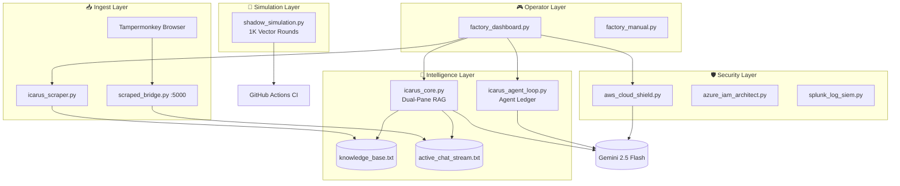

<p align="center">
  
  
  
  
</p>

<h1 align="center">🛰️ Icarus Factory</h1>
<p align="center">
  <strong>Enterprise-grade hypervisor for zero-trust cloud optimization, security modeling, and high-throughput gaming network simulation.</strong><br/>
  <em>Built for operators who model infrastructure like competitive telemetry—precise, headless, and battle-tested.</em>
</p>

---

## 🎯 Mission

**Icarus Factory** is a commercial-grade platform in active development. It unifies:

| Pillar | Capability |
|--------|------------|
| **🛡️ Zero-Trust Security** | IAM policy synthesis, wildcard linting, Azure RBAC simulation |
| **📡 Live Intelligence** | Dual-pane RAG (`knowledge_base.txt` + `active_chat_stream.txt`) |
| **🔮 Balance Engineering** | Headless vector match simulation (`shadow_simulation.py`) |
| **☁️ Cloud Prototyping** | AWS Cloud Shield, SIEM mock pipelines, deployment hypervisor patterns |

Target vertical: **high-throughput gaming networks** (Riot-scale infrastructure patterns, esports telemetry, map choke-point balance modeling).

---

## 🏗️ Stack Footprint

```text
Runtime ........ Python 3.12 (venv)
UI Layer ....... Rich (terminal dashboards, live panes)
AI Router ...... LiteLLM → gemini/gemini-2.5-flash
Ingest API ..... Flask + Flask-CORS (localhost:5000)
HTTP Client .... requests (+ BeautifulSoup in scraper)
CI/CD .......... GitHub Actions (ubuntu-latest)
```

### 📦 Core Dependencies (`requirements.txt`)

| Package | Role |
|---------|------|
| `rich` | Operator dashboards, dual-pane RAG stream, radar UI |
| `litellm` | Unified LLM gateway to Gemini 2.5 Flash |
| `flask` / `flask-cors` | `scraped_bridge.py` — Tampermonkey → RAG ingest |
| `requests` | Public meta/news harvesting (`icarus_scraper.py`) |

> **Note:** `icarus_scraper.py` uses `beautifulsoup4` and `icarus_cron_bot.py` uses `pywin32` (Windows SAPI). Install when running those modules:  
> `pip install beautifulsoup4 pywin32`

---

## 🗺️ Architecture Overview



---

## 🚀 Quick Start

### 1. Boot the environment

```powershell
d:
cd D:\AI_Factory
.\venv\Scripts\Activate.ps1
pip install -r requirements.txt
```

### 2. Launch the control matrix

```powershell
python factory_dashboard.py
```

### 3. Operational keys

| Key | Module | Purpose |
|:---:|--------|---------|
| **1** | `icarus_core.py` | Dual-pane RAG watch + Gemini comparison |
| **2** | `smart_cleaner.py` | Live workspace radar & training loop |
| **3** | `icarus_agent_loop.py` | Autonomous 10-min agent ledger |
| **4** | `icarus_scraper.py` | Harvest public meta → `knowledge_base.txt` |
| **5** | `aws_cloud_shield.py` | Zero-trust IAM JSON + local lint |
| **Q** | — | Exit dashboard |

### 4. View the operations manual

```powershell
python factory_manual.py
```

### 5. Run CI verification locally

```powershell
python shadow_simulation.py
```

---

## 📂 Module Directory

| Module | Layer | Description |
|--------|-------|-------------|
| `factory_dashboard.py` | Control | Master menu; launches venv Python subprocesses |
| `factory_manual.py` | Control | Rich operations manual & boot codes |
| `icarus_core.py` | RAG | Live dual-pane stream (2s poll) + Gemini diff router |
| `icarus_agent_loop.py` | Agent | Resource guard + `agent_log.txt` self-evaluation |
| `icarus_scraper.py` | Ingest | Web scrape → append `knowledge_base.txt` |
| `scraped_bridge.py` | API | Flask `/ingest` POST → `active_chat_stream.txt` |
| `shadow_simulation.py` | Simulation | 1,000-round headless vector balance engine |
| `smart_cleaner.py` | Ops | Real-time file radar + HITL training promotion |
| `aws_cloud_shield.py` | Security | Gemini IAM policies + wildcard SIEM lint |
| `icarus_cron_bot.py` | Automation | Scheduled `smart_cleaner` + Windows TTS (D: drive) |
| `gamedev_builder.py` | GameDev | Research → Build → Teach → Lead pipeline stub |
| `azure_iam_architect.py` | Security | Azure RBAC zero-trust simulator |
| `splunk_log_siem.py` | Security | Mock SIEM DENY event table |
| `security_plus_proctor.py` | Training | SY0-701 domain weight dashboard |

---

## 🧠 Data Management (RAG Streams)

| Vault | File | Role |
|-------|------|------|
| **Macro (Structural)** | `knowledge_base.txt` | Permanent enterprise designs, scraped intel |
| **Micro (Live)** | `active_chat_stream.txt` | Browser/ChatGPT/Gemini snippets (2s poll in core) |
| **Agent Memory** | `agent_log.txt` | Timestamped autonomous action tokens |

**Cursor tip:** Reference `@knowledge_base.txt` in chat to ground AI loops on your structural layer.

---

## ⚙️ CI/CD

Workflow: `.github/workflows/ci.yml`

- **Trigger:** `push` / `pull_request` → `main` or `master`
- **Runner:** `ubuntu-latest`, Python 3.12
- **Gate:** `python shadow_simulation.py` (syntax + runtime smoke test)

---

## 🔒 Security Notes

- Never commit `.env` (API keys for LiteLLM/Gemini).
- `venv/`, `__pycache__/`, and `.cursor/` are gitignored.
- Cloud Shield rejects IAM policies containing global `"*"` wildcards.

---

## 🛣️ Roadmap (Preview)

| Phase | Target |
|-------|--------|
| **Phase 0** *(current)* | Local text RAG, headless sim, Flask ingest, CI gate |
| **Phase 1** | Containerized sim workers + object-store KB versioning |
| **Phase 2** | Multi-tenant SaaS API, network security layer simulation |
| **Phase 3** | Enterprise gaming-network hypervisor (Riot-class deployment patterns) |

---

<p align="center">
  <sub>🛰️ <strong>Icarus Factory</strong> — Elevate infrastructure. Simulate before you ship.</sub>
</p>
